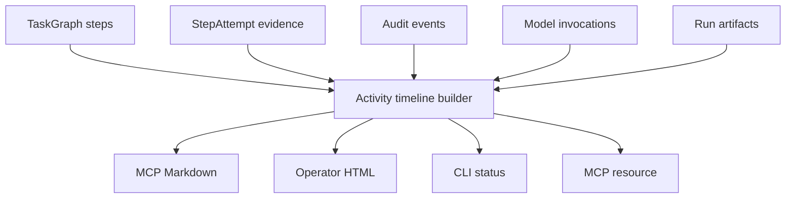

# Workspace Steps UX Plan

## Goal
Build a unified Steps/Activities view that shows both Kiwi plan steps and the actual workspace activity happening inside them: routing, context, runner execution, diff capture, gates, review, approvals, replans, finalize, and publish. The view should improve operator UX without introducing a second execution state machine.

The persisted truth remains:

- `TaskGraph` and `Step` in [`packages/contracts/src/domain/index.ts`](packages/contracts/src/domain/index.ts)
- `StepAttempt`, `GateResult`, `ReviewVerdict`, `SchedulerDecision`, `AttemptSummary` in [`packages/contracts/src/execution/index.ts`](packages/contracts/src/execution/index.ts)
- audit events from [`packages/core/src/ledger/cost-ledger.ts`](packages/core/src/ledger/cost-ledger.ts)
- run evidence loaded by [`packages/core/src/runs/lifecycle/evidence-collection.ts`](packages/core/src/runs/lifecycle/evidence-collection.ts)

The new UX is a derived read model.

## UX Shape
Use two levels:

- **Plan steps**: the semantic work items from the current `TaskGraph`, e.g. `step_002 Modify scheduler policy`.
- **Workspace activities**: the actual things Kiwi did under or around those steps, e.g. `Select runner/model`, `Build context package`, `Run executor`, `Capture diff`, `Run gates`, `Review attempt`.

Example target rendering:

```text
✓ Plan task graph
● Execute workspace changes
  ✓ step_001 Discover current status model
    ✓ Select codex via codex-cli
    ✓ Build context package
    ✓ Run executor
    ✓ Run gates
    ✓ Review passed
  ● step_002 Render activity timeline
    ✓ Select cursor-agent via cursor-agent-cli
    ● Run executor
    ○ Capture diff
    ○ Review attempt
○ Finalize run
```

Statuses should be visually consistent across Markdown, CLI, and HTML:

- `✓` completed
- `●` running
- `○` pending
- `!` failed
- `■` blocked
- `-` skipped

If ASCII-only output is required in CLI non-TTY mode, render `[done]`, `[run]`, `[todo]`, `[fail]`, `[blocked]`, `[skip]` instead.

## Data Flow


## Phase 1: Add A Read-Only Activity Model
Add a new builder in [`packages/ops/src/summaries/activity-timeline.ts`](packages/ops/src/summaries/activity-timeline.ts). Keep it in `@kiwi/ops`, not `@kiwi/core`, because it composes read models and presentation-facing summaries, similar to [`packages/ops/src/summaries/run-summary.ts`](packages/ops/src/summaries/run-summary.ts).

Proposed internal/public shape:

```ts
export interface RunActivityTimeline {
  schemaVersion: "1";
  runId: string;
  generatedAt: string;
  summary: {
    total: number;
    completed: number;
    running: number;
    pending: number;
    failed: number;
    blocked: number;
  };
  activities: RunActivityEntry[];
}

export interface RunActivityEntry {
  activityId: string;
  parentActivityId?: string;
  runId: string;
  stepId?: string;
  attemptId?: string;
  phase: "planning" | "preview" | "routing" | "context" | "execution" | "diff" | "gate" | "review" | "approval" | "replan" | "finalize" | "publish";
  title: string;
  status: "pending" | "running" | "completed" | "failed" | "blocked" | "skipped";
  startedAt?: string;
  completedAt?: string | null;
  artifactRefs: string[];
  metadata?: Record<string, unknown>;
}
```

Implementation rules:

- Do not persist `RunActivityTimeline` initially.
- Derive it from `loadTaskGraph`, `listStepAttemptEvidence`, `readAuditEvents`, and optionally `readModelInvocations`.
- Preserve TaskGraph order for planned steps.
- Use audit timestamps for chronological child activities.
- Include historical attempts, not only latest attempt, because retries and failed attempts are important operator evidence.
- Keep run-level activities separate from step activities: planning, preview, replan, finalize, publish.

## Phase 2: Activity Derivation Mapping
Implement deterministic mapping from existing evidence to activity entries.

Run-level activities:

- Planner provider selected, retries, validation failures, planner succeeded/failed from audit events in [`packages/core/src/ledger/cost-ledger.ts`](packages/core/src/ledger/cost-ledger.ts)
- MCP preview created/consumed/pruned
- Replan started/succeeded/failed and fix-step injected from [`packages/runtime/src/planning/replanner.ts`](packages/runtime/src/planning/replanner.ts)
- Finalized from [`packages/runtime/src/lifecycle/finalize.ts`](packages/runtime/src/lifecycle/finalize.ts)
- Evidence manifest and operator snapshot events from [`packages/ops/src/evidence/index.ts`](packages/ops/src/evidence/index.ts) and [`packages/ops/src/operator/surface.ts`](packages/ops/src/operator/surface.ts)

Step-level activities:

- Routing selected or blocked from scheduler decisions and scheduler audit events in [`packages/runtime/src/policies/scheduler-policy.ts`](packages/runtime/src/policies/scheduler-policy.ts)
- Context package created from `context-package.json` and `context_package_created`
- Runner execution from `step_attempt_started`, `runner_attempt_completed`, `runner_attempt_failed`
- Diff materialization from `attempt_diff_applied` and `attempt_diff_apply_failed` in [`packages/runtime/src/execution/diff-workflow.ts`](packages/runtime/src/execution/diff-workflow.ts)
- Gates from `gate-results.json` plus `gate_command_executed`
- Review from `review-report.json` plus `step_attempt_reviewed`
- Next action from `attempt-summary.json` plus `step_attempt_next_action`
- Approval from `approval_decision_recorded`

Status derivation:

- A planned `Step` with no attempt is `pending`.
- Latest attempt `running` or `pending` makes the step activity `running`.
- Completed gates and passed review make child activities `completed`.
- Failed runner, failed gate, reject review, or failed diff apply make the relevant activity `failed`.
- Blocked scheduler, blocked gate, or blocked attempt maps to `blocked`.
- Previously completed steps skipped by rerun should show as `skipped` only for that execution pass, not overwrite their canonical completed state.

## Phase 3: Add Render Helpers
Add rendering helpers where presentation already lives.

Recommended files:

- [`apps/mcp-server/src/ux/render.ts`](apps/mcp-server/src/ux/render.ts) for Markdown rendering.
- [`packages/ops/src/operator/surface.ts`](packages/ops/src/operator/surface.ts) for HTML rendering.
- Optionally [`packages/ops/src/operator/activity-render.ts`](packages/ops/src/operator/activity-render.ts) if shared HTML/Markdown helpers would keep files smaller.

Add helpers like:

```ts
export function renderActivityTimelineMarkdown(input: RunActivityTimeline): string;
export function renderActivityTreeLines(input: RunActivityTimeline): string[];
```

Rendering rules:

- Keep titles short and human-readable.
- Default to the current plan order, with run-level activities before and after the step list.
- Show model/runner labels for routing activities, matching the existing UX contract in [`docs/ux/rendering-contract.md`](docs/ux/rendering-contract.md).
- Show only the highest-value metadata inline: model, runner, gate status, review verdict, next action, edited files count.
- Link or list artifacts separately, not inline in every row.

## Phase 4: Expose As MCP Resource And Tool Output
Extend [`apps/mcp-server/src/resources/index.ts`](apps/mcp-server/src/resources/index.ts):

- Add `kiwi://runs/{runId}/activity-timeline` as `application/json`.
- Optionally add `kiwi://runs/{runId}/activity-timeline.md` as `text/markdown` if clients benefit from a direct Markdown resource.

Extend [`apps/mcp-server/src/ux/operator-card.ts`](apps/mcp-server/src/ux/operator-card.ts):

- Add a resource link named `activityTimeline`.
- Add a compact `stepsSummary` only if it stays small: total/completed/running/blocked/failed and current active step title.

Extend [`apps/mcp-server/src/ux/render.ts`](apps/mcp-server/src/ux/render.ts):

- Improve `run_status` rendering to use the activity timeline or a slim step checklist.
- Improve `run_execution_preview` rendering so planned steps look like pending checklist items.
- Improve `run_execution_result` rendering so finished and active steps look like the same checklist, not a separate format.

Keep raw JSON opt-in via `KIWI_MCP_OUTPUT_FORMAT=json`, as required by [`docs/ux/rendering-contract.md`](docs/ux/rendering-contract.md).

## Phase 5: Improve Operator HTML Snapshot
Update [`packages/ops/src/operator/surface.ts`](packages/ops/src/operator/surface.ts):

- Replace the current static Steps table with a visual activity timeline.
- Keep a compact summary grid: total steps, completed, running, failed/blocked, attempts, risk, complexity.
- Add CSS state classes for `pending`, `running`, `completed`, `failed`, `blocked`, `skipped`.
- Render child activities indented beneath their parent step.
- Keep artifact links in the existing Artifacts section.

Do not make this a live web dashboard. The snapshot remains a deterministic artifact at `.kiwi/runs/<run-id>/operator/index.html`.

Optional later enhancement: write/refresh the operator snapshot automatically after important step boundaries. Do not include this in the first implementation unless explicitly wanted, because it changes write frequency and run artifacts.

## Phase 6: Improve CLI Surfaces
Update [`apps/cli/src/commands/runs/status.ts`](apps/cli/src/commands/runs/status.ts):

- Keep default compact run list unchanged if backwards compatibility matters.
- Improve `--verbose` to show the activity checklist instead of separate `step_status`, `completed_steps`, `remaining_steps`, and `active_activity` blocks.
- Consider adding `--activity` if changing `--verbose` output is too disruptive.

Update [`apps/cli/src/commands/runs/run.ts`](apps/cli/src/commands/runs/run.ts):

- At run start, print the planned checklist once.
- On each step boundary, print a concise update that matches MCP progress language.
- Keep the 30-second heartbeat, but include the current activity title when possible.

Update [`apps/cli/src/commands/runs/tail.ts`](apps/cli/src/commands/runs/tail.ts) only if needed:

- Keep audit-tail machine-style behavior by default.
- Optionally add a human activity mode later, e.g. `kiwi tail --activity`.

## Phase 7: Workspace-Level View
After per-run timeline is stable, add workspace aggregation.

Add a builder such as:

```ts
export function buildWorkspaceActivityTimeline(input: {
  cwd: string;
  repoId?: string;
  repoPath?: string;
  limit?: number;
}): WorkspaceActivityTimeline;
```

Behavior:

- Iterate `listRunIds(cwd)`.
- Load each run manifest and filter by `repoId`/`repoPath` when provided.
- Build each run timeline and merge by timestamp.
- Keep `runId` visible on every item.
- Limit output by most recent runs or activities to prevent noisy chat responses.

Expose later as:

- `kiwi://workspace/activity-timeline`
- optional CLI `kiwi activity`
- optional MCP read-only tool if resource access is not enough

This answers the original UX idea most directly: not only “what is this Kiwi run doing,” but “what is happening in this workspace.”

## Phase 8: Tests And Validation
Add focused tests first around the read model, then surface tests.

Core test additions:

- New [`packages/ops/src/__tests__/summaries/activity-timeline.test.ts`](packages/ops/src/__tests__/summaries/activity-timeline.test.ts)
- Cover planned-only runs, running attempt, completed attempt, failed runner, blocked gate, review failure, replan/fix-step, finalized run, and retries.
- Assert stable ordering and parent-child relationships.

MCP tests:

- Update [`apps/mcp-server/src/__tests__/mcp.test.ts`](apps/mcp-server/src/__tests__/mcp.test.ts) for the new resource and Markdown rendering.
- Add render-specific tests if useful, e.g. `apps/mcp-server/src/__tests__/render.test.ts`, to avoid overusing full MCP integration tests.

CLI tests:

- Update [`apps/cli/src/__tests__/runs/status.test.ts`](apps/cli/src/__tests__/runs/status.test.ts) for verbose or `--activity` output.
- Update run progress tests if existing fixtures assert exact lines.

Operator tests:

- Update [`packages/ops/src/__tests__/evidence/evidence-operator.test.ts`](packages/ops/src/__tests__/evidence/evidence-operator.test.ts) for HTML timeline rendering.
- Update [`apps/cli/src/__tests__/operations/operator.test.ts`](apps/cli/src/__tests__/operations/operator.test.ts) if CLI snapshot output changes.

Recommended validation commands for implementation:

```bash
pnpm --filter @kiwi/ops test
pnpm --filter @kiwi/mcp-server test
pnpm --filter @kiwi/cli test -- runs/status
pnpm --filter @kiwi/ops typecheck
pnpm --filter @kiwi/mcp-server typecheck
pnpm --filter @kiwi/cli typecheck
```

Adjust exact filters to the package scripts in `package.json` during implementation.

## Scope Boundaries
Keep in first pass:

- Read-only per-run activity timeline.
- MCP resource and improved Markdown status/result rendering.
- Operator HTML timeline.
- CLI verbose checklist.

Defer:

- Automatic snapshot regeneration after every activity.
- A dashboard or live web UI.
- Persisting activities as first-class artifacts.
- Enforcing typed schemas for every audit payload.
- Workspace-wide aggregation CLI unless the per-run version lands cleanly.

## Risks And Mitigations
Risk: duplicate state or drift from real execution.
Mitigation: timeline is derived only; no new writer owns execution state.

Risk: noisy output in chat.
Mitigation: render top-level checklist by default, child activities only for active, failed, blocked, or verbose views.

Risk: audit payloads are loosely typed.
Mitigation: use structured artifacts first, audit events second; ignore unknown audit payloads safely.

Risk: plan versions and replans confuse ordering.
Mitigation: label plan version changes explicitly and attach attempts to the plan that existed at their timestamp when possible; current-plan view can still default to current `TaskGraph`.

Risk: Unicode markers may be awkward in some terminals.
Mitigation: keep ASCII fallback for CLI non-TTY or `--no-color` paths.

## Acceptance Criteria
The change is successful when:

- A run with no attempts shows a pending planned checklist.
- A running run shows the active step and active workspace activity.
- A completed run shows completed steps with gate/review/diff children.
- A failed or blocked run makes the failing/blocked activity obvious without reading JSON.
- MCP, CLI, and operator HTML use consistent status labels and ordering.
- Raw JSON remains available for programmatic MCP consumers.
- No execution behavior, safety gates, or run artifact ownership changes are introduced.