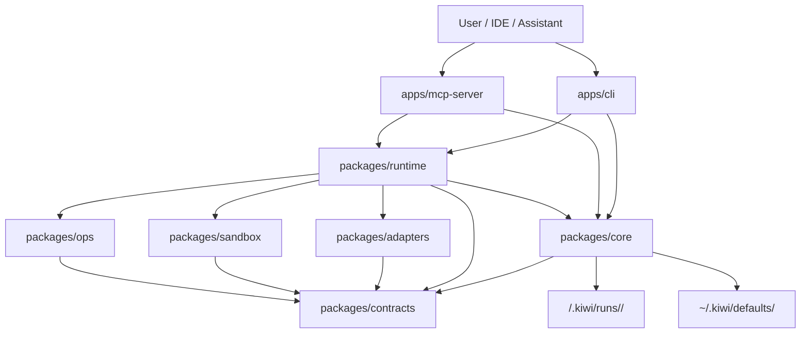

# kiwi Architecture

## Scope

This document describes the current codebase behind `docs/vision.md`.

Status: current local-first control plane with CLI and MCP surfaces, Codex-first
local execution, preview-gated MCP mutation, evidence artifacts, and Bitbucket PR
draft publishing.

## System Shape



## Packages And Apps

`apps/cli`

- Reference operator surface.
- Registers `init`, `doctor`, `workspace list`, `models list`, `models update`, `config set approver`, `plan`, `status`, `explain`, `cost`, `run`, `runs unlock`, `attempt`, `approve`, `diff`, `apply`, `tail`, `finalize`, `evidence manifest`, `operator snapshot`, `publish pr`, and `rules sync`.
- Loads workspace/home config, resolves workspace/repo, and composes CLI workflows.

`apps/mcp-server`

- MCP access channel over the same run store and runtime services.
- Supports stdio and local HTTP transports.
- Exposes read-only router and preview-gated mutating tools.
- Requires preview tokens for `kiwi_run`, `kiwi_run_step`, and `kiwi_apply`.

`packages/contracts`

- Zod schemas, inferred TypeScript types, and canonical value constants.
- Owns serialized contracts for Initiative, Run, TaskGraph, StepAttempt, GateResult, ReviewVerdict, evidence, policy, model registry, and SCM draft artifacts.

`packages/core`

- Config and workspace resolution.
- Planning primitives and deterministic run creation.
- Run store, run status, run locks, approvals, audit ledger, and model/cost ledgers.
- No provider SDKs, runner execution, SCM credentials, or runtime orchestration ownership.

`packages/runtime`

- Executable workflow composition.
- Scheduler policy, provider/runner resolution, execution previews, direct execution safety, StepAttempt orchestration, gates, review, replanning, finalization, and diff apply workflow.
- Depends on Core services and Adapter/Sandbox boundaries.

`packages/adapters`

- Planner, reviewer, researcher, runner, and SCM adapter implementations.
- Includes Codex CLI, Claude Code CLI, Cursor Agent CLI, local shell, stub providers, and Bitbucket Cloud SCM support.

`packages/sandbox`

- Worktree lifecycle.
- Process execution.
- Diff capture and patch apply helpers.
- Permission, command, and environment enforcement support.

`packages/ops`

- Operator-facing artifacts.
- Evidence manifests, run summaries, operator HTML snapshots, and PR draft publishing.

## Dependency Rules

- Apps may compose packages.
- `packages/core` may depend on `packages/contracts` only.
- `packages/runtime` may depend on `core`, `contracts`, `adapters`, and `sandbox`.
- `packages/adapters` may depend on `contracts` and `sandbox`.
- `packages/sandbox` may depend on `contracts`.
- `packages/ops` may depend on `core`, `runtime`, `adapters`, and `contracts`.
- Provider-specific SDKs and SCM credentials stay outside Core.

## Persistence Layout

Shared home defaults:

```text
~/.kiwi/
  defaults/
    policy.yaml
    model-registry.yaml
  install/
```

Workspace state:

```text
<workspace>/.kiwi/
  config.yaml
  policy.yaml                  # optional overlay
  model-registry.yaml          # optional overlay
  logs/
    audit.log
  runs/
    <run-id>/
      run.lock                    # optional; includes ownerPid and optional expiresAt
      run.json
      initiative.json
      plan/
        task-graph.json
        planner-input.json
        planner-output.json
        planner-cost.json
      previews/
        preview_<hash>_<nonce>.json
      approvals/
        <attempt-id>.json
      steps/
        step_001/
          attempt_<id>/
            attempt.json
            scheduler-decision.json
            context-package.json
            gate-results.json
            review-report.json
            cost-report.json
            artifacts/
              diff.patch
              command-output.txt
      final/
        final-summary.md
        final-verdict.json
        final-cost-report.json
        final-cost-report.csv
        evidence-manifest.json
        audit-events.json
        pr-draft.json
      operator/
        index.html
      worktrees/
        <attempt-id>/
```

Home defaults are required. Workspace policy and registry files are overlays.
Run folders are the canonical persistence form.

## Config Model

`kiwi init` creates:

- `~/.kiwi/defaults/policy.yaml`
- `~/.kiwi/defaults/model-registry.yaml`
- `<workspace>/.kiwi/config.yaml`
- optional MCP client config for Cursor, Claude Code, and Codex

`KIWI_HOME=<path>` changes the shared home. Workspace overrides live under
`<workspace>/.kiwi/` and are merged over home defaults.
`<workspace>/.kiwi/config.yaml` can also store `approver.identity` for MCP
approval recommendations.

## Routing Model

Routing is two-stage:

1. Select `agentRole`.
2. Select `modelCapability`.

The scheduler then selects:

- runner/access mode
- concrete model id and `providerModel`
- context level
- required gates
- review depth
- estimated attempt cost
- approval state
- execution isolation

Default local access preference:

1. `KIWI_FORCE_ACCESS_MODE`, when set
2. Codex CLI
3. Claude Code CLI
4. Cursor Agent CLI
5. direct provider API modes, when configured
6. stub, only when explicitly allowed

Default capability mapping:

| Step type | Agent role | Capability |
| --- | --- | --- |
| `planning` | `planner` | `frontier` |
| `review` | `reviewer` | `frontier` |
| `validation` | `reviewer` | `strong` |
| `coding` | `executor` | `strong` |
| `code_creation` | `executor` | `strong` |
| `code_modification` | `executor` | `strong` |
| `refactoring` | `executor` | `strong` |
| `test_creation` | `executor` | `mid` |
| `documentation` | `executor` | `mid` |
| `rules_update` | `executor` | `mid` |
| `scm_ticket` | `executor` | `mid` |
| `scm_pull_request` | `executor` | `mid` |
| `scm_review` | `executor` | `mid` |

Risk zones can escalate execution and review. Security constraints are not
weakened by budget pressure.

## Execution Model

Default execution isolation is `direct`.

Direct mode:

- Runs in the selected repo working tree.
- Captures a git baseline before execution.
- Persists the StepAttempt diff as a run artifact.
- Blocks protected-looking branches, dirty tracked files, untracked non-Kiwi files, and non-git repos.
- Keeps staging, commits, tags, and pushes forbidden unless the user explicitly requested that operation.

Worktree mode:

- Enabled with `KIWI_EXECUTION_ISOLATION=worktree`.
- Creates attempt worktrees under the run.
- Requires explicit apply/publish flows to affect the source repo.

CLI mutating commands execute directly after local checks. MCP mutating tools
require a fresh preview token that binds run state, repo state, policy,
`fromStep`, `maxConcurrency`, and command override.

## MCP Tool Flow

Preferred assistant flow:

```text
kiwi_doctor -> kiwi_plan -> kiwi_next -> kiwi_preview_run -> user confirmation -> recommendedToolCall -> kiwi_next -> finalize/evidence/snapshot
```

MCP tools:

- `kiwi_doctor`
- `kiwi_plan`
- `kiwi_status`
- `kiwi_models_update`
- `kiwi_models_update_apply`
- `kiwi_next`
- `kiwi_preview_run`
- `kiwi_run`
- `kiwi_run_step`
- `kiwi_diff`
- `kiwi_apply`
- `kiwi_cost`
- `kiwi_explain`
- `kiwi_request_approval`
- `kiwi_finalize`
- `kiwi_evidence_manifest`
- `kiwi_operator_snapshot`
- `kiwi_publish_pr_draft`

`kiwi_preview_run` writes a preview artifact and returns a single-use
`previewToken`. Stale tokens are rejected after relevant policy, repo, command,
or run-state changes.
`kiwi_models_update` uses the same confirm-before-write pattern with a
model-update preview token before `kiwi_models_update_apply` refreshes home
defaults.

## Gates, Review, And Approval

Every StepAttempt can produce:

- scheduler decision
- runner output
- artifacts
- gate results
- review report
- cost report
- model invocation records

Quality gates include policy checks, forbidden file checks, secret checks, and
step-required gates. Review verdicts are structured JSON.

Approval-required paths and command profiles are policy-driven. CLI records
approval with `kiwi approve`. MCP records approval with `kiwi_request_approval`
and requires an explicit non-placeholder `approvedBy` identity.

Run locks are written as `run.lock` under each run. Lock acquisition reclaims a
lock whose `ownerPid` no longer exists and records `run_lock_reclaimed`.
Operators can release stale locks with `kiwi runs unlock <run-id>`; forced
release records `run_lock_forced_release` with `approvedBy`.

## Cost And Evidence

Cost is part of planning, preview, execution, and finalization.

Artifacts include:

- model invocation records
- run cost summaries
- final cost JSON and optional CSV
- evidence manifest with file hashes
- run-scoped audit snapshot
- local operator HTML snapshot

## SCM Boundary

SCM integration lives behind adapters.

Current publish behavior:

- `kiwi publish pr <run-id>` pushes a local Bitbucket branch using existing git auth.
- It stages only expected diff files.
- It requires a clean target repo, including untracked files.
- It writes `final/pr-draft.json` and a Bitbucket create-PR URL.
- It does not store API credentials.

## Future Work

- Broader SCM provider parity.
- Richer operator UI if needed.
- Agent-to-agent interop only after a new ADR and explicit contracts.
