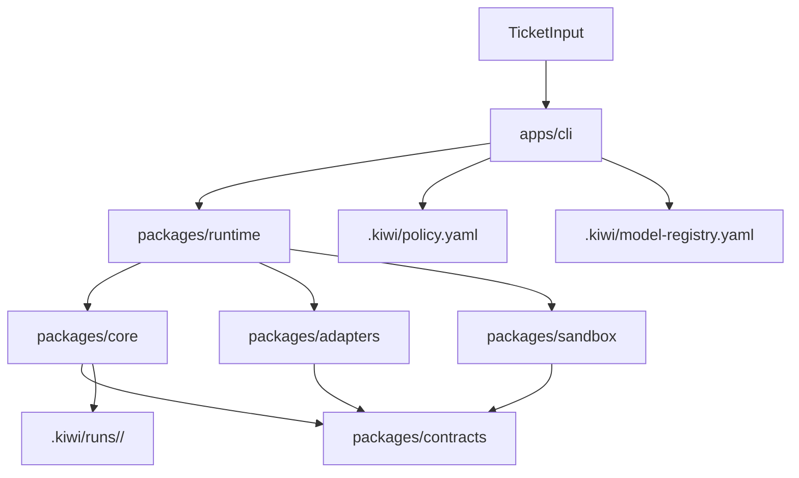

# kiwi Architecture

## Scope

Dieses Dokument konkretisiert `docs/vision.md` fuer die aktuelle Codebasis.
MVP 1 fokussiert auf Planning Foundation: Intake, deterministic TaskGraph, Run Store und CLI.

## Architektur-Ueberblick



## Module

- `apps/cli`
  - Kommandos: `init`, `plan`, `status`
  - laedt Policy/Registry
  - triggert deterministic planner
- `packages/core`
  - Initiative creation
  - deterministic TaskGraph builder
  - Run persistence im Ziel-Layout
  - status aggregation
- `packages/contracts`
  - kanonische Zod-Schemas und Domain Types
  - zentrale Begriffe fuer Initiative/Run/TaskGraph
- `packages/runtime`
  - Composition Layer fuer CLI/MCP executable flows
  - loest Provider, Access Modes und Runner auf
  - verbindet Core, Adapters und Sandbox ohne eigene Persistenzhoheit
- `packages/adapters`
  - Provider-, Runner- und SCM-Adapter hinter stabilen Interfaces
- `packages/sandbox`
  - Worktree Lifecycle, Command Policy, Prozessausfuehrung und Diff-Capture

## Persistenzlayout

```text
.kiwi/
  config.yaml
  policy.yaml
  .kiwi/model-registry.yaml
  runs/
    <run-id>/
      run.json
      initiative.json
      plan/
        task-graph.json
```

## Dependency Rules

- `apps/*` duerfen von `packages/*` abhaengen.
- `packages/core` darf nur gegen `packages/contracts` sprechen.
- `packages/runtime` darf `core`, `contracts`, `adapters` und `sandbox`
  komponieren, besitzt aber keine kanonischen Contracts und keine
  Provider-spezifische Logik.
- Contracts enthalten keine runtime side effects.
- Provider-/Runner-Integrationen gehoeren in `packages/adapters`.

## A2A Freeze

Bis `docs/plans/step-22-end-to-end-real-run-demo.md` `Status: DONE` ist,
bleibt A2A eingefroren. Erlaubt sind nur mechanische Move-/Import-Updates, die
vom A2A-Freeze-Gate akzeptiert werden. Neue A2A-Kommandos, Runtime-Semantik,
Payload-Arten oder Trust-Regeln sind nicht in Scope.

## Nicht in MVP 1

- echte LLM Calls
- runner execution
- MCP server
- dashboard/tui
- A2A runtime

## Model Tier Mapping

Capability tiers in `.kiwi/model-registry.yaml` map to local CLI access modes by
default. Direct provider API keys are not required for daily use.
`cheap` is an alias of `mid` with a reduced context budget.

| Capability | Default Local Access         | Notes                            |
| ---------- | ---------------------------- | -------------------------------- |
| frontier   | claude-code-cli opus         | planner, high-risk reviewer      |
| strong     | claude-code-cli/codex/cursor | default coding, default reviewer |
| mid        | claude-code-cli haiku        | tests, docs, rules, research     |
| cheap      | mid with smaller context     | alias behavior, not API key path |

## Tier-to-Step-Type Defaults

The scheduler picks `agentRole` and `modelCapability` from the policy
`stepTypeOverrides`. Defaults below match `.kiwi/policy.yaml` and the
defaults written by `kiwi init`. Risk zones from `riskZones.high` may
escalate execution and review tiers; downgrading for security-sensitive
steps is not allowed.

| Step Type           | Agent Role | Model Capability |
| ------------------- | ---------- | ---------------- |
| planning            | planner    | frontier         |
| review              | reviewer   | frontier         |
| validation          | reviewer   | strong           |
| coding              | executor   | strong           |
| code_creation       | executor   | strong           |
| code_modification   | executor   | strong           |
| refactoring         | executor   | strong           |
| test_creation       | executor   | mid              |
| documentation       | executor   | mid              |
| rules_update        | executor   | mid              |
| scm_ticket          | executor   | mid              |
| scm_pull_request    | executor   | mid              |
| scm_review          | executor   | mid              |
