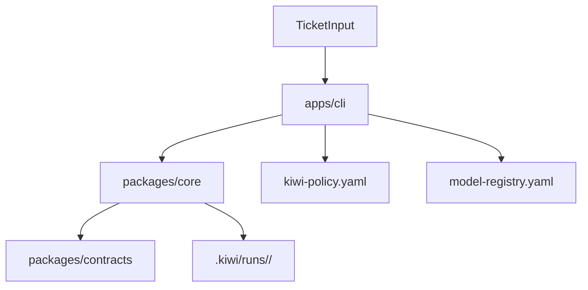

# kiwi Architecture

## Scope

Dieses Dokument konkretisiert `docs/vision.md` fuer die aktuelle Codebasis.
MVP 1 fokussiert auf Planning Foundation: Intake, deterministic TaskGraph, Run Store und CLI.

## Architektur-Ueberblick



## Module

- `apps/cli`
  - Kommandos: `init`, `plan`, `status`
  - laedt Policy/Registry
  - triggert deterministic planner
- `packages/core`
  - Initiative creation
  - deterministic TaskGraph builder
  - Run persistence im Ziel-Layout
  - status aggregation
- `packages/contracts`
  - kanonische Zod-Schemas und Domain Types
  - zentrale Begriffe fuer Initiative/Run/TaskGraph

## Persistenzlayout

```text
.kiwi/
  config.yaml
  runs/
    <run-id>/
      run.json
      initiative.json
      plan/
        task-graph.json
```

## Dependency Rules

- `apps/*` duerfen von `packages/*` abhaengen.
- `packages/core` darf nur gegen `packages/contracts` sprechen.
- Contracts enthalten keine runtime side effects.
- Provider-/Runner-Integrationen gehoeren spaeter in `packages/adapters`.

## Nicht in MVP 1

- echte LLM Calls
- runner execution
- MCP server
- dashboard/tui
- A2A runtime
